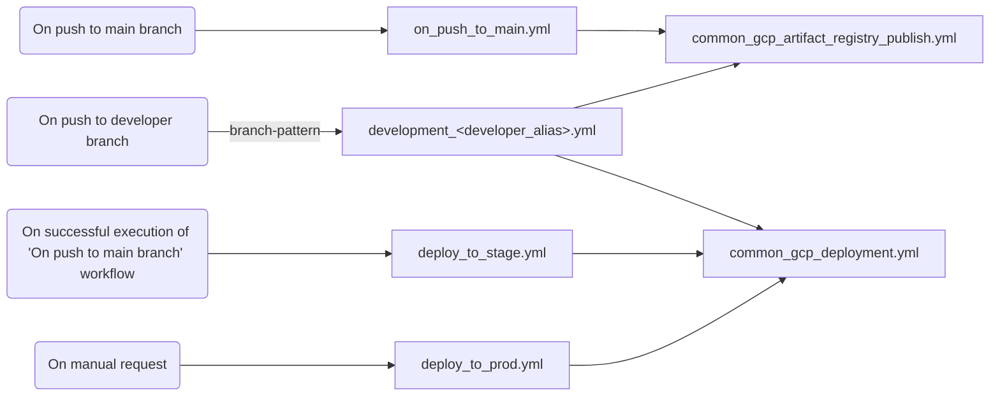

# mmartinbarr personal repo

Hi, I'm @mmartinbarr and I'm using this repo as a sandbox to test stuff

```mermaid
graph LR;
COMMON_PUBLISH[common_gcp_artifact_registry_publish.yml]
COMMON_DEPLOYMENT[common_gcp_deployment.yml]
DEVELOPER["development_&lt;developer_alias&gt;.yml"]
BUILD_AND_PUBLISH_IMAGE[on_push_to_main.yml]
ON_PUSH(On push to developer branch)
ON_MERGE("On push to main branch")
ON_SUCCESSFUL_EXECUTION_OF_ON_MERGE("On successful execution of 'On push to main branch' workflow")
DEPLOY_TO_STAGE[deploy_to_stage.yml]
ON_MANUAL_REQUEST("On manual request")
DEPLOY_TO_PROD[deploy_to_prod.yml]
ON_MERGE --> BUILD_AND_PUBLISH_IMAGE
BUILD_AND_PUBLISH_IMAGE --> COMMON_PUBLISH
ON_PUSH -->|branch-pattern| DEVELOPER
DEVELOPER --> COMMON_PUBLISH
DEVELOPER --> COMMON_DEPLOYMENT
ON_SUCCESSFUL_EXECUTION_OF_ON_MERGE --> DEPLOY_TO_STAGE
DEPLOY_TO_STAGE --> COMMON_DEPLOYMENT
ON_MANUAL_REQUEST --> DEPLOY_TO_PROD
DEPLOY_TO_PROD --> COMMON_DEPLOYMENT
```
